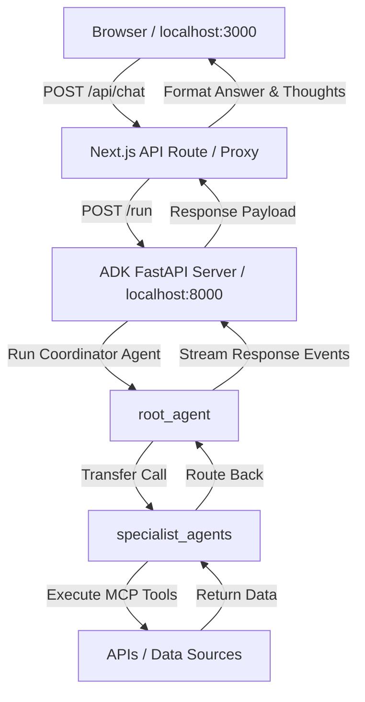

# TrAdeGent - Stocks & Crypto Chatbot Frontend

A modern, responsive React/Next.js chatbot interface designed to interact with the `root_agent` coordinator running on the Google Agent Development Kit (ADK). It features an interactive, step-by-step "Thought Process" logger that reveals which specialist sub-agents (`crypto_agent`, `stocks_agent`) were contacted and which tools were invoked.

---

## ⚠️ Troubleshooting the 429 Quota Error

If you run the app and see **`Agent run failed: Internal Server Error`** or a `429 RESOURCE_EXHAUSTED` error in the server terminal, it means your Gemini API key has hit the **Gemini Free Tier Rate Limit**:
- **Free Tier Limit**: 20 requests per day per project/model.
- **Solution**: 
  1. Wait for the quota to reset (the error message in the backend terminal will show a countdown like `Please retry in X seconds`).
  2. Swap the API key in `trading-agent/root_agent/.env` with a paid/unrestricted Gemini API key.

---

## Prerequisites

Before starting, ensure you have the following installed on your system:
- **Node.js**: v18.0.0 or higher (comes with `npm`)
- **Python**: v3.10 or higher
- **ADK CLI**: Installed in your Python environment (`pip install google-adk`)

---

## Environment & API Keys Setup

1. Locate the `.env` file in the `trading-agent/root_agent` directory.
2. Ensure it contains the following keys (replace placeholder keys with your own if needed):

```env
GOOGLE_GENAI_USE_VERTEXAI=0
GOOGLE_API_KEY=YOUR_GEMINI_API_KEY
ALPHAVANTAGE_API_KEY=YOUR_ALPHA_VANTAGE_API_KEY
```

- **`GOOGLE_API_KEY`**: Needed for the coordinator (`root_agent`) and specialist LLMs.
- **`ALPHAVANTAGE_API_KEY`**: Needed by `stocks_agent` to query stock ticker prices, historical charts, and indicators.

---

## How to Run the Application (Every Time)

To connect the Next.js frontend to the ADK agent engine, you must run both the backend server and the frontend server in **two separate terminal windows**.

### Step 1: Start the Backend Agent Server
Open your **first terminal window** and run:

```bash
# 1. Navigate to the trading-agent directory
cd trading-agent

# 2. Activate the Python virtual environment (if applicable)
source .venv/bin/activate

# 3. Start the ADK FastAPI server on port 8000
adk web --port 8000
```

Keep this terminal open. It will show log events as the coordinator agent runs queries.

### Step 2: Start the Next.js Frontend
Open a **second terminal window** and run:

```bash
# 1. Navigate to the chat-ui directory
cd trading-agent/chat-ui

# 2. Install dependencies (only required the first time)
npm install

# 3. Start the Next.js development server
npm run dev
```

Keep this terminal open. The console will display a link: **`http://localhost:3000`**.

---

## How It Works (Architecture)



1. **Frontend Input**: The user selects a quick query or writes a message and clicks **Send**.
2. **Next.js Proxy (`/api/chat`)**: Receives the request and acts as a server-side proxy. This prevents browser CORS restrictions and formats the responses.
3. **Session Verification**: The proxy checks if a session ID exists on the ADK server. If not, it creates one.
4. **ADK Agent Invocation (`localhost:8000/run`)**: The proxy forwards the message to the ADK FastAPI server. The `root_agent` coordinates with sub-agents, resolves tool calls (e.g., getting prices), and returns execution logs.
5. **Thought Extraction**: The proxy parses the logs, compiles a timeline of tool calls and agent transfers, and returns the final answers and the trace log to display in the UI.
